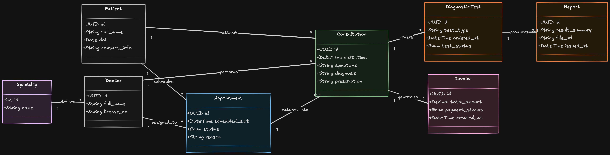

# Clinic Management Platform — ER Diagram

A complete Entity-Relationship diagram designed for a clinic management 
and patient care platform.

## Overview

This diagram models the full database structure of a clinic platform 
that supports:
- Managing doctor profiles with specialties
- Booking and tracking patient appointments
- Converting appointments into actual consultations or visits
- Ordering and tracking diagnostic tests from consultations
- Generating reports linked to diagnostic tests
- Handling invoicing and payment status per consultation

## Entities

- **Patient** — Stores patient details including date of birth and contact information
- **Doctor** — Stores doctor profile with license number linked to a specialty
- **Specialty** — Separate entity for doctor specializations
- **Appointment** — Represents a scheduled slot with status and reason
- **Consultation** — Represents the actual visit that results from an appointment
- **DiagnosticTest** — Tests ordered during a consultation with status tracking
- **Report** — Results and summaries generated from diagnostic tests
- **Invoice** — Billing record with payment status linked to a consultation

## Key Design Decisions

- Appointment and Consultation are modeled as separate entities because 
not every appointment results in a consultation
- The relationship between Appointment and Consultation is labeled 
"matures_into" to reflect the real world clinical workflow accurately
- DiagnosticTest is linked to Consultation rather than Appointment because 
tests are ordered during the actual visit, not at the time of booking
- Specialty is a separate entity rather than a plain string attribute on 
Doctor to keep the design properly normalized
- UUID is used as the primary key type across all entities for real world 
scalability and uniqueness
- Enum types are used for status fields to enforce data consistency at 
the database level

## Diagram

## Tools Used

- Designed using [Eraser.io](https://eraser.io)
